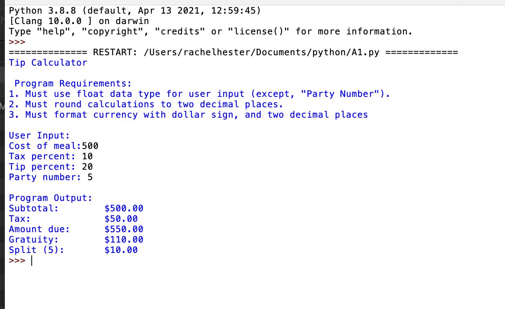
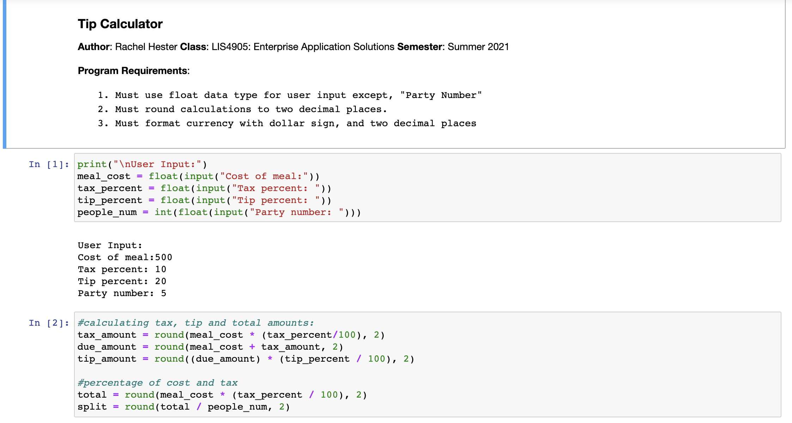
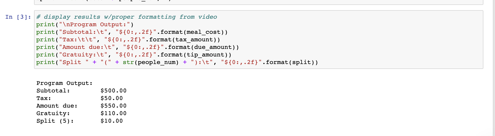

# LIS4369 Extensible Enterprise Solutions

## Rachel Hester

### Assignment 1 Requirements:

#### README.md file should include the following items:

1. Screenshotof a1_tip_calculator application running using IDLE (see below);
2. Screenshotof a1_tip_calculator application running using Visual Studio Code (see below);
3. Upload A1 .ipynbfile andcreate link in README.md;
* Note: *Before* uploading .ipynbfile, 
* be sure * to do the following actions from Kernal menu: 
    a.Restart & Clear Output
    b.Restart & Run All  
4. git commands w/short descriptions(“Lesson 3b -Version Control Systems: Course Configuration”;
5. Bitbucket repo links: a.This assignment, and 
    b.The completed tutorial repoabove (bitbucketstationlocations) .(See link in screenshot below.)
    
> This is a blockquote.
> 
> This is the second paragraph in the blockquote.
>
#### Git commands w/short descriptions:

1. git init - creates new Git repository
2. git status - displays the state of the working directory and the staging area
3. git add - adds a change in the working directory to the staging area
4. git commit - used to save your changes to local repository
5. git push - used to upload local repository content to a remote repository
6. git pull - used to fetch and download content from a remote repository and immediately update the local repository to match that content
7. git uncommit - uncommit your last commit in git 

#### Assignment Screenshots:

1. Screenshot of IDLE                                  
 

2. Screenshot of VSCode

3. Screenshot of Jupyter Notebook

*Links to Notebook and Python File Below:* 

1. Link to Python File
[Python File](docs/A1.py "A1 Python File")

2. Link to Notebook
[Notebook](docs/A1.ipynb "A1 Jupyter Notebook")

#### Tutorial Links:

*Bitbucket Tutorial - Station Locations:*
[A1 Bitbucket Station Locations Tutorial Link](https://bitbucket.org/rah18b/bitbucketstationlocations/src/master/ "Bitbucket Station Locations")

*LIS4369 Assignment 1:*
[A1 Link](https://bitbucket.org/rah18b/lis4369/src/master/ "LIS4369 - Assignment 1")

