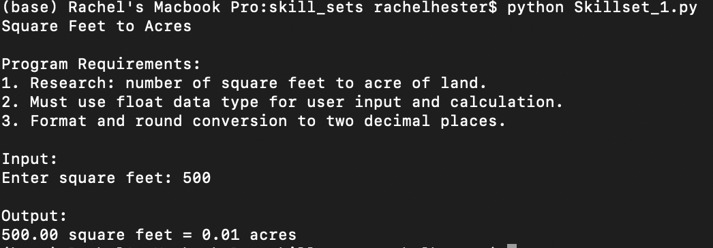
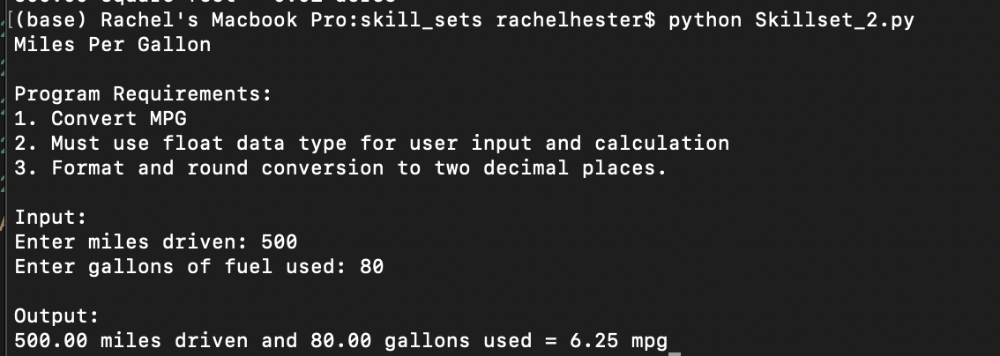
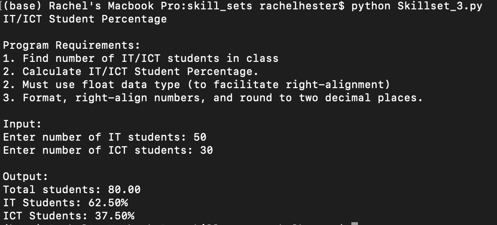
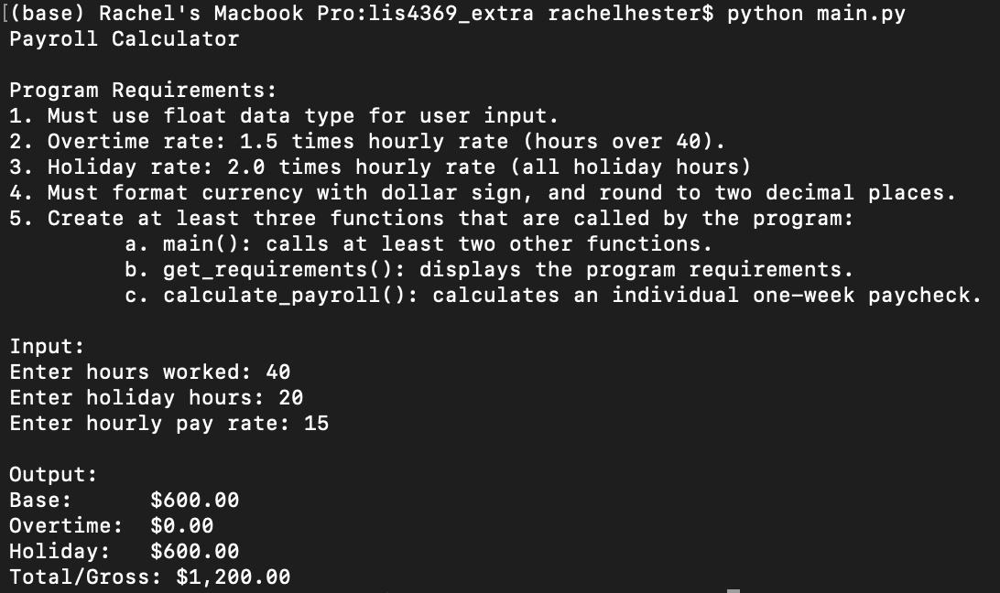
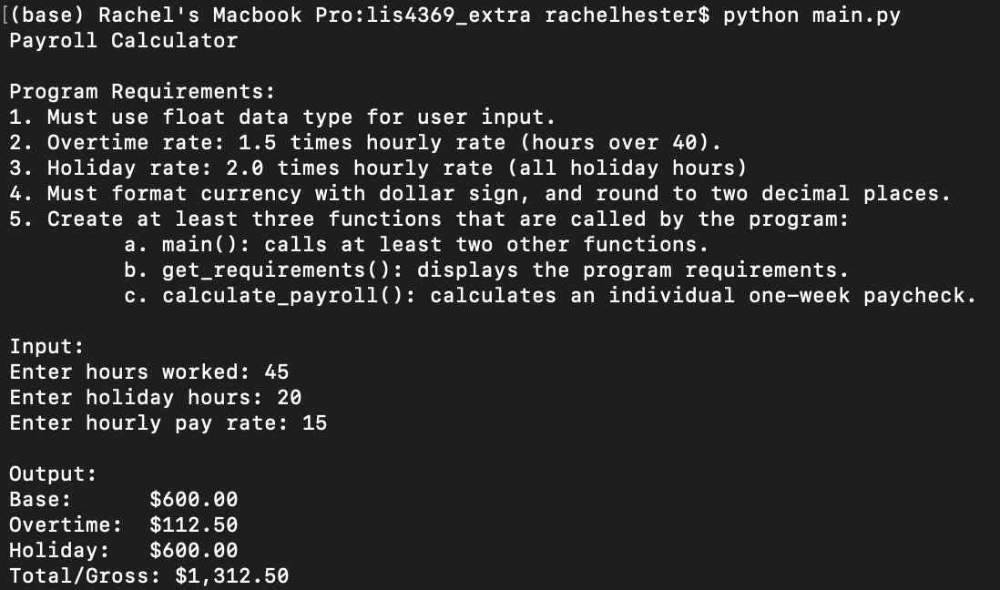
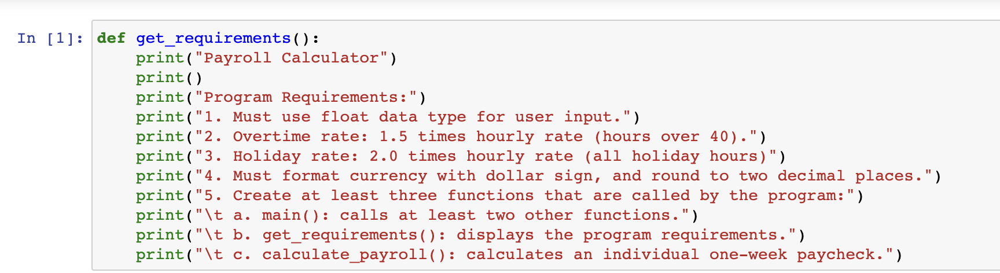
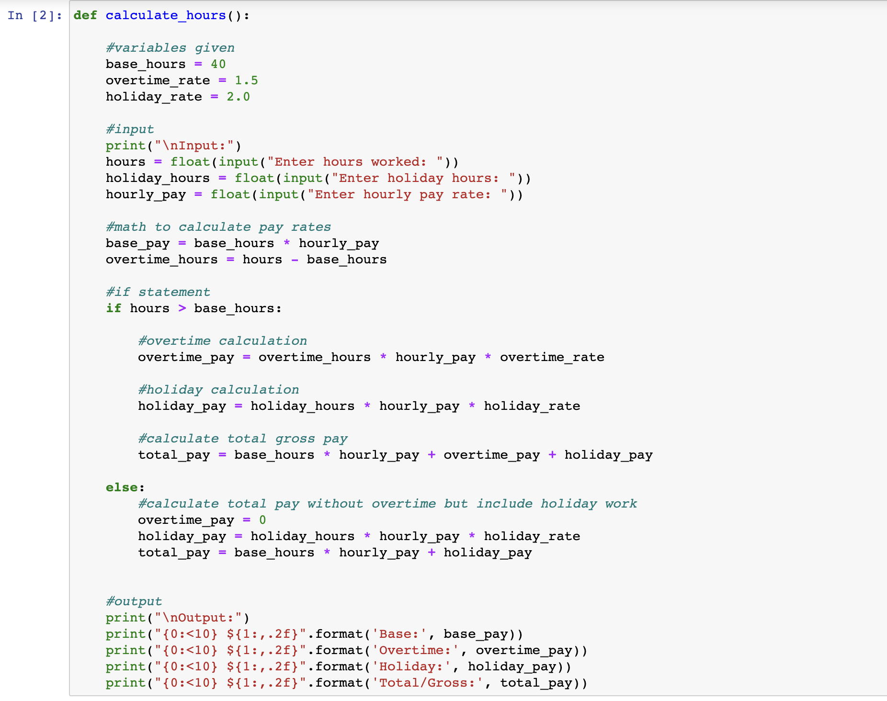
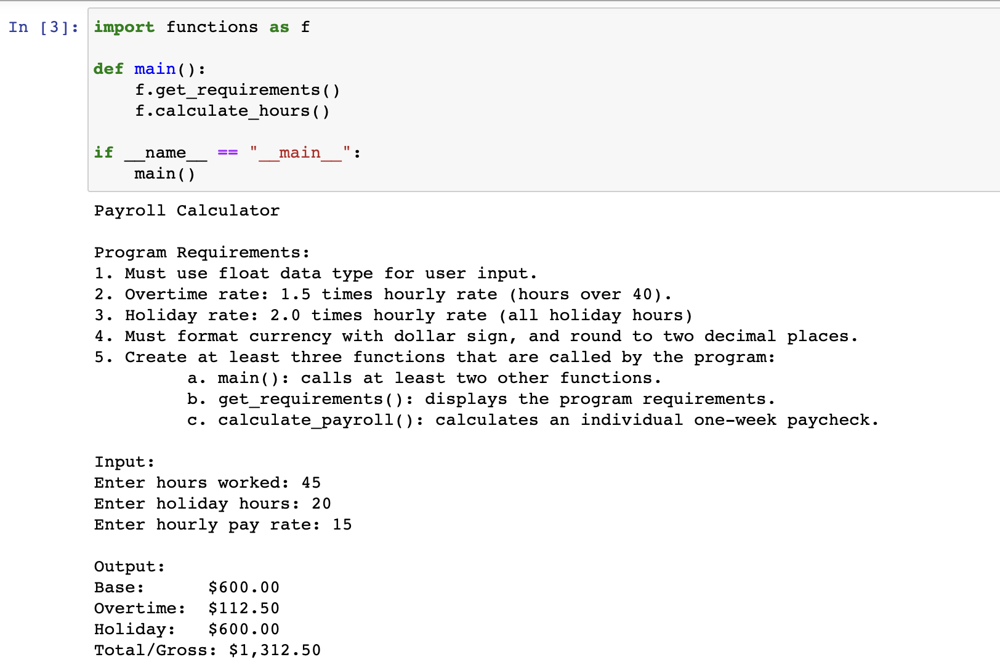
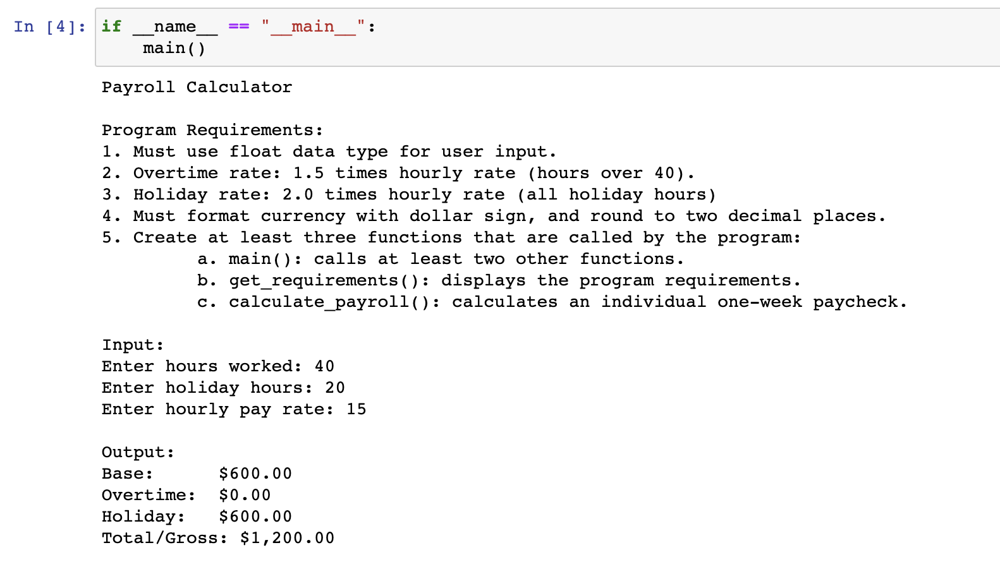

# LIS4369 Extensible Enterprise Solutions

## Rachel Hester

### Assignment 2 Requirements:

#### README.md file should include the following items:

1. Assignment requirements, as per A2.
2. Screenshots as per examples below.
3. Upload A2 .ipynbfile andcreate link in README.md;
Note:*Before* uploading .ipynbfile, *be sure* to do the following actions from Kernal menu:
    a. Restart & Clear Output
    b. Restart & Run All

> This is a blockquote.
> 
> This is the second paragraph in the blockquote.
>

#### Assignment Screenshots:
1. Screenshots of Skillsets 1, 2, & 3

2. Payroll No Overtime                                 
 

3. Payroll with Overtime 

4. Screenshots of Jupyter Notebook

*Links to Notebook and Python File Below:* 

1. Links to Python Files
[Python File](docs/functions.py "A2 Python File Functions")
[Python File](docs/main.py "A2 Python File Main")

2. Link to Notebook
[Notebook](docs/A2.ipynb "A2 Jupyter Notebook")

