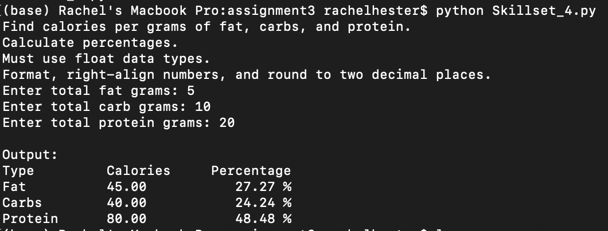
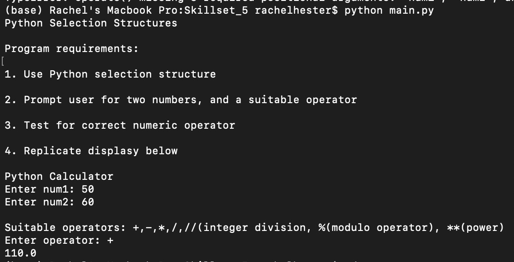
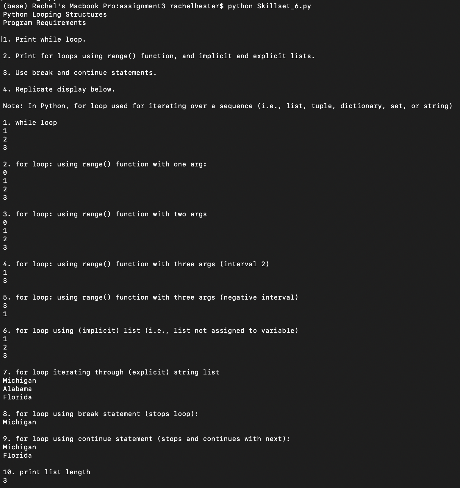
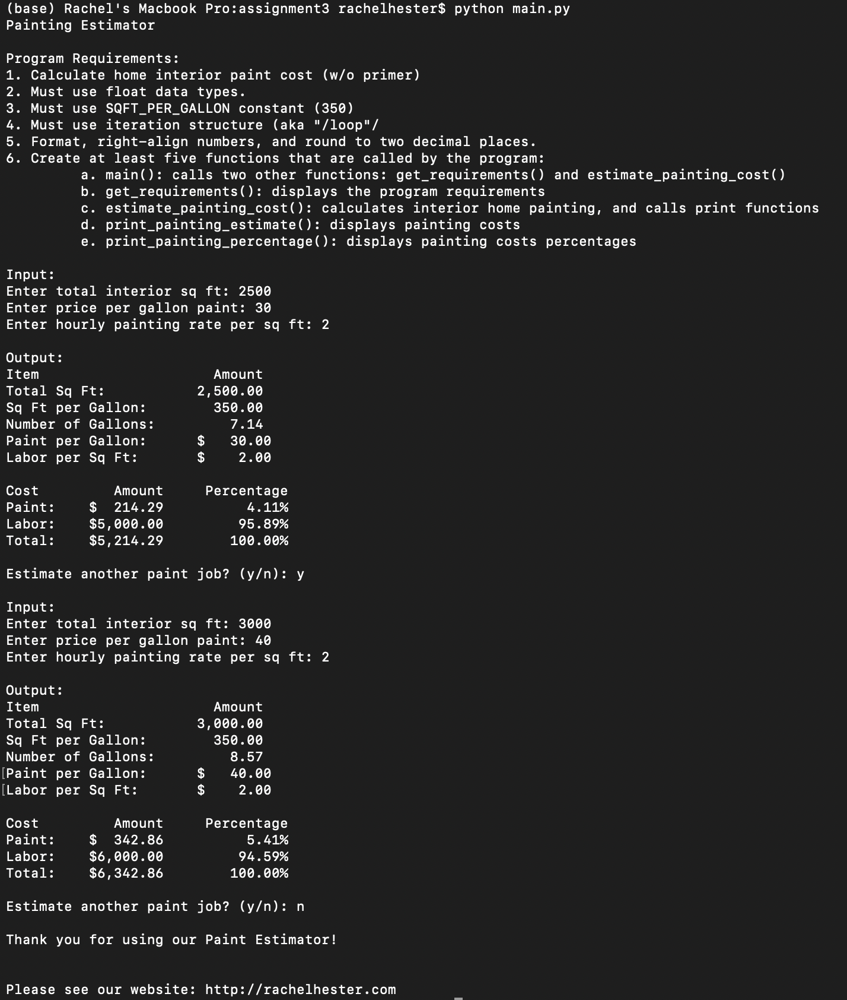
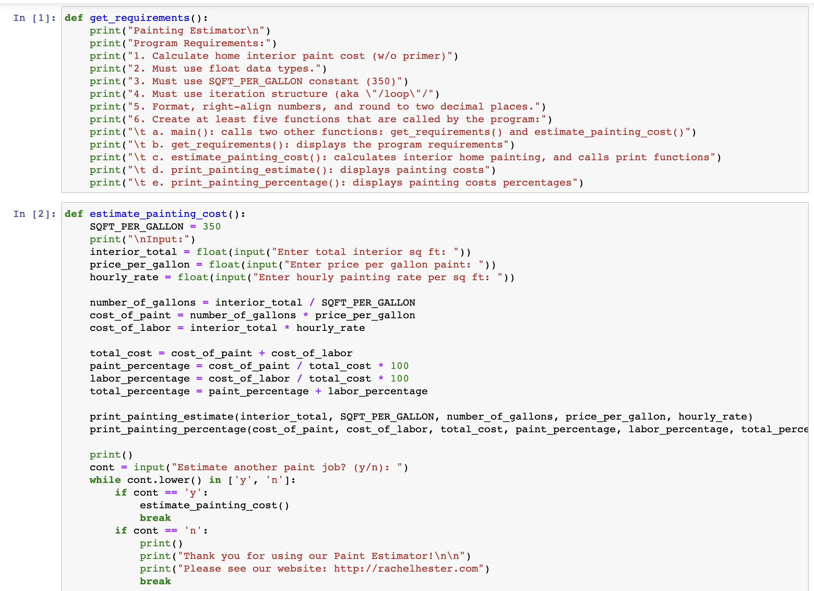
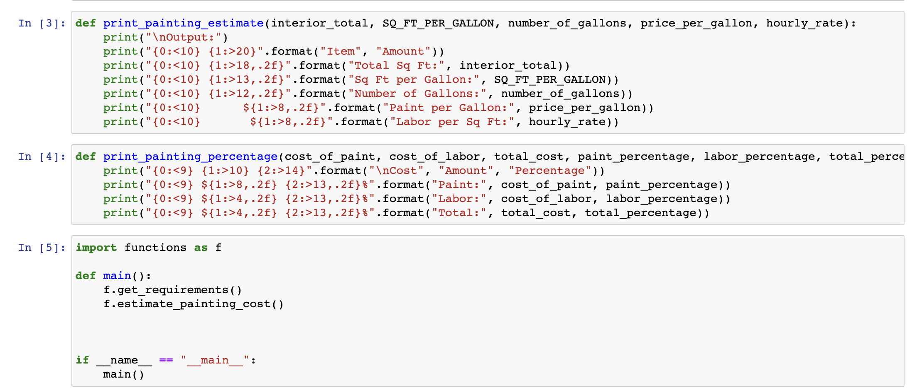
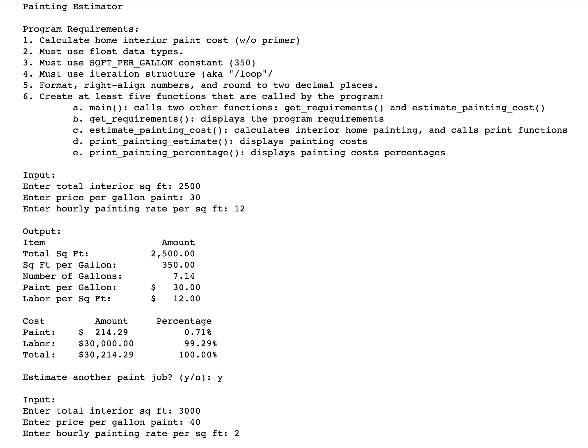
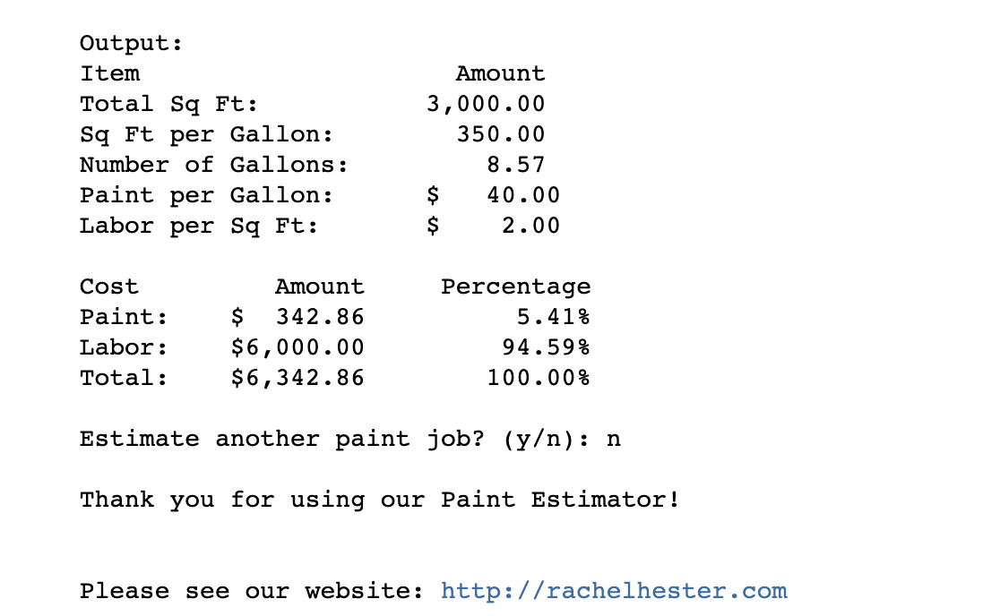

# LIS4369 Extensible Enterprise Solutions

## Rachel Hester

### Assignment 3 Requirements:

#### README.md file should include the following items:

1. Assignment requirements, as per A3.
2. Screenshots as per examples below.
3. Upload A3 .ipynb file andcreate link in README.md;
    Note:*Before* uploading .ipynbfile, *be sure* to do the following actions from Kernal menu:
     - Restart & Clear Output
     - Restart & Run All

> This is a blockquote.
> 
> This is the second paragraph in the blockquote.
>

#### Assignment Screenshots:
1. Screenshots of Skillsets 4, 5, & 6

2. Painting Estimator Terminal Screenshot                                  
 

3. Screenshots of Jupyter Notebook

*Links to Notebook and Python File Below:* 

1. Links to Python Files
[Python File](docs/functions.py "A3 Python File Functions")
[Python File](docs/main.py "A3 Python File Main")

2. Link to Notebook
[Notebook](docs/Assignment_3.ipynb "A3 Jupyter Notebook")

