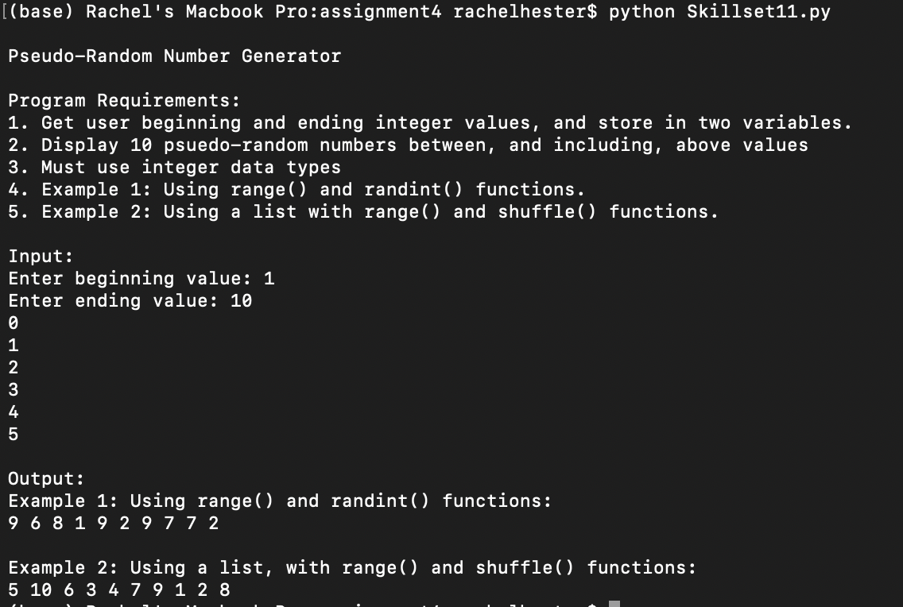

# LIS4369 Extensible Enterprise Solutions

## Rachel Hester

### Assignment 4 Requirements:

#### README.md file should include the following items:

1. Assignment requirements, as per A4.
2. Screenshots as per examples below, including *graph*.
3. Upload A4 .ipynb file andcreate link in README.md;
    Note:*Before* uploading .ipynb file, *be sure* to do the following actions from Kernal menu:
     - Restart & Clear Output
     - Restart & Run All

> This is a blockquote.
> 
> This is the second paragraph in the blockquote.
>

#### Assignment Screenshots:
1. *Screenshots of Skillsets 10, 11, & 12*

*Screenshot of Skillset 10*:             |  *Screenshot of Skillset 11*:
:-------------------:|:------------------------------:
  |  

*Screenshot of Skillset 12:*

2. Screenshots of Jupyter Notebook

*Screenshot of Jupyter Notebook Part 1*:             |  *Screenshot of Jupyter Notebook Part 2*:
:-------------------:|:------------------------------:
  |  

*Screenshot of Jupyter Notebook Part 3*:             |  *Screenshot of Jupyter Notebook Part 4*:
:-------------------:|:------------------------------:
  |  

*Screenshot of Jupyter Notebook Part 5*:             |  *Screenshot of Jupyter Notebook Part 6*:
:-------------------:|:------------------------------:
  |  

*Screenshot of Jupyter Notebook Part 7*:             |  *Screenshot of Jupyter Notebook Part 8*:
:-------------------:|:------------------------------:
  |  

*Screenshot of Jupyter Notebook Part 9*:             |  *Screenshot of Jupyter Notebook Part 10*:
:-------------------:|:------------------------------:
  |  

*Screenshot of Jupyter Notebook Part 11*:             |  *Screenshot of Jupyter Notebook Part 12*:
:-------------------:|:------------------------------:
  |  

*Screenshot of Jupyter Notebook Part 13*:             |  *Screenshot of Jupyter Notebook Part 14*:
:-------------------:|:------------------------------:
  |  

*Screenshot of Jupyter Notebook Part 15*:             |  *Screenshot of Jupyter Notebook Part 16*:
:-------------------:|:------------------------------:
  |  

*Screenshot of Jupyter Notebook Part 17*:           

> The graph line is split because some of the people in the data do not have ages associated with them, specifically persons 13, 14, and 15. 

*Links to Notebook and Python File Below:* 

1. Links to Python Files
[Python File](docs/functions.py "A4 Python File Functions")
[Python File](docs/main.py "A4 Python File Main")

2. Link to Notebook
[Notebook](docs/assignment4.ipynb "A4 Jupyter Notebook")

