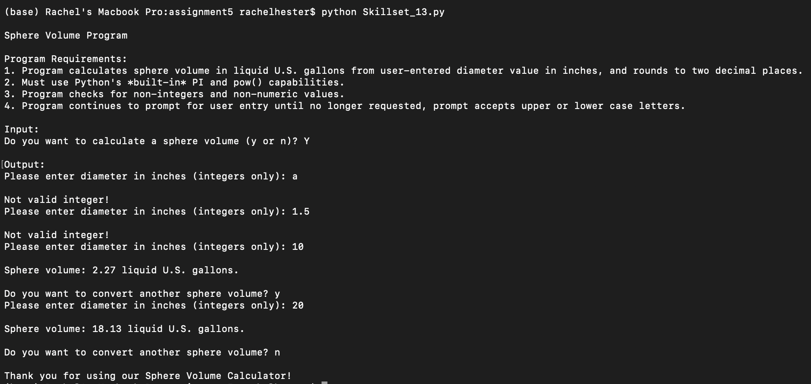
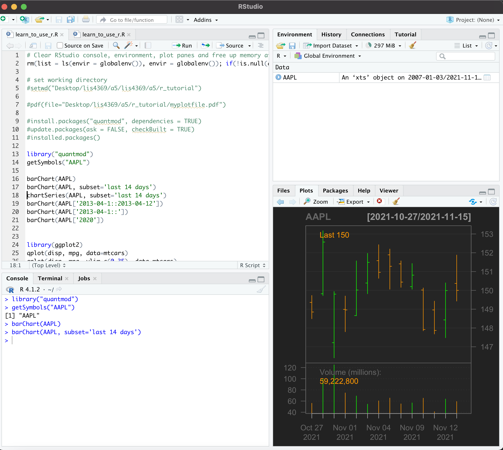

# LIS4369 Extensible Enterprise Solutions

## Rachel Hester

### Assignment 5 Requirements:

#### README.md file should include the following items:

1. Requirements: 
    - a. Complete the following tutorial: Introduction_to_R_Setup_and_Tutorial (includes A5 requirements): Save as: learn_to_use_r.R 
    - b. Code and run lis4369_a5.R (see below). Include link to file in a5 README.md file. 
    - c. Include at least two 4-panel RStudio screenshots : 1) learn_to_use_r.R, and 2) lis4369_a5.R code. 
    - d. Also, be sure to include at least four plots—that is, at least two plots for the tutorial, and two plots for the assignment file (below), in your README.md file. 
2. Be sure to test your program using RStudio. 
 

> This is a blockquote.
> 
> This is the second paragraph in the blockquote.
>

#### Assignment Screenshots:
1. *Screenshots of Skillsets 13, 14, & 15*

*Screenshot of Skillset 13*:             |  *Screenshot of Skillset 14*:
:-------------------:|:------------------------------:
  |  

*Screenshot of Skillset 15:*

2. Screenshots of RStudio

*Screenshot of Learning RStudio Part 1*:             |  *Screenshot of Learning RStudio Part 2*:
:-------------------:|:------------------------------:
  |  

*Screenshot of Learning RStudio Part 3*:             |  *Screenshot of A5 RStudio Part 1*:
:-------------------:|:------------------------------:
  |  

*Screenshot of A5 RStudio Part 2*:             |  *Screenshot of A5 RStudio Part 3*:
:-------------------:|:------------------------------:
  |  

*Links to R Files Below:* 

1. Links to R Files
[R File](r_tutorial/learn_to_use_r.R "Learning RStudio R File")
[R File](docs/lis4369_a5.R "A5 RStudio File")

