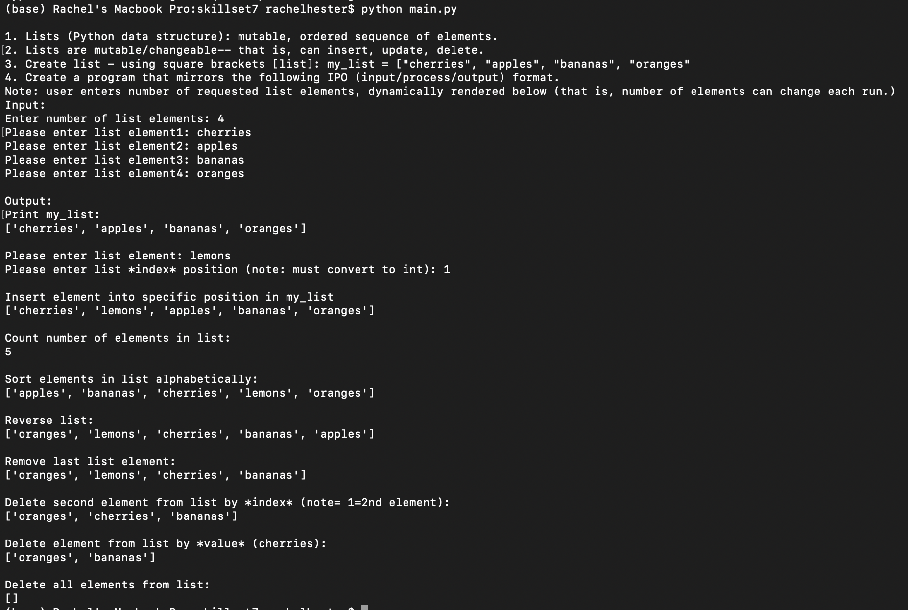
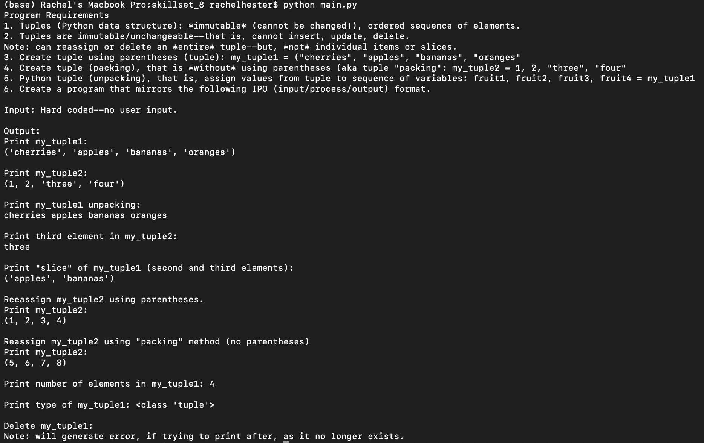
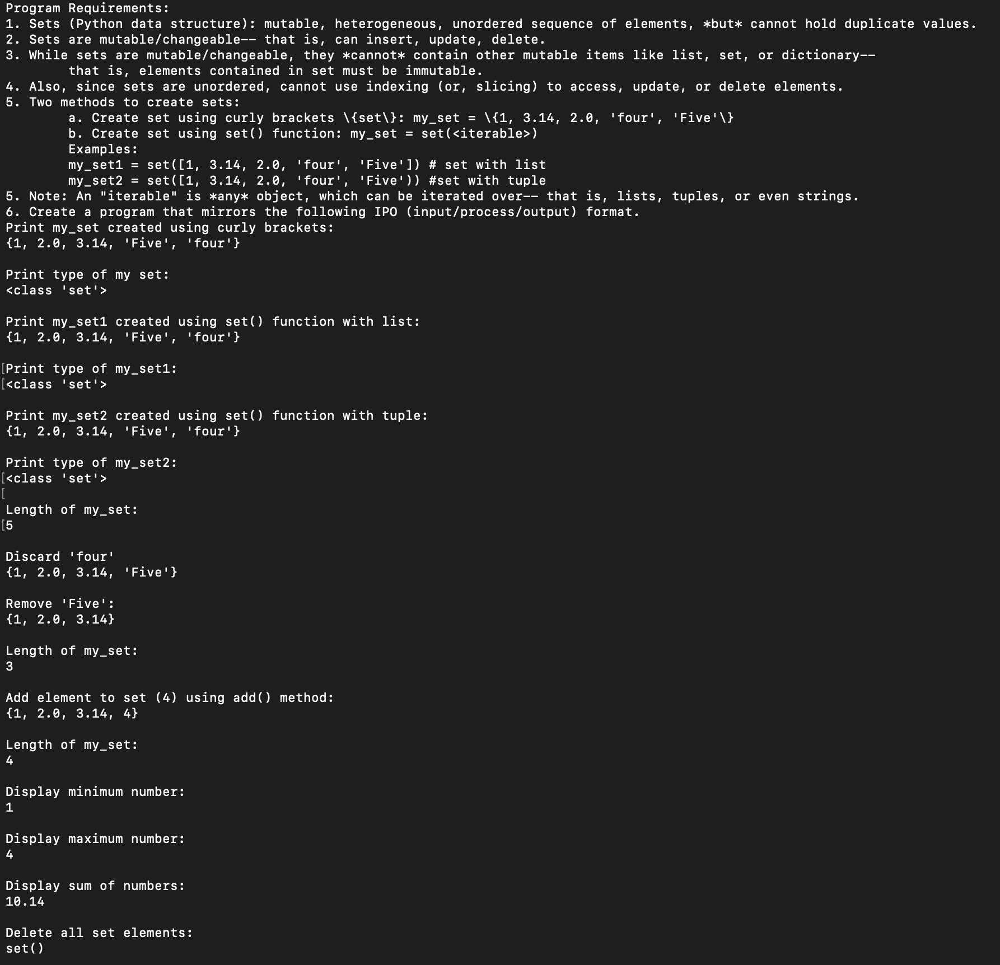
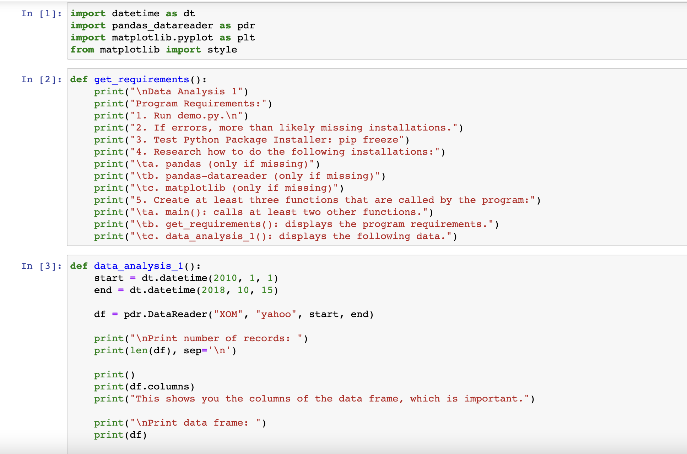
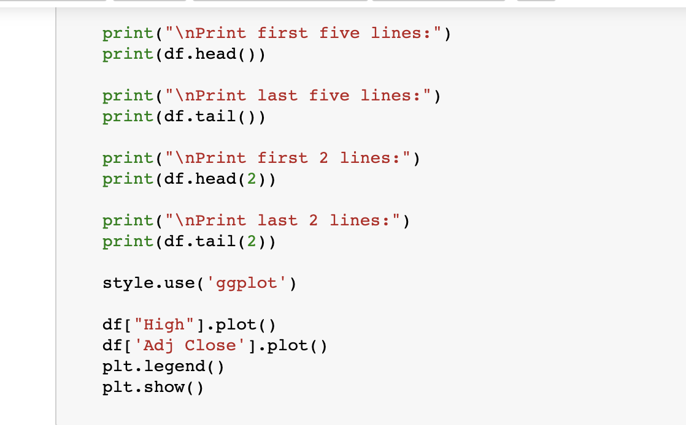
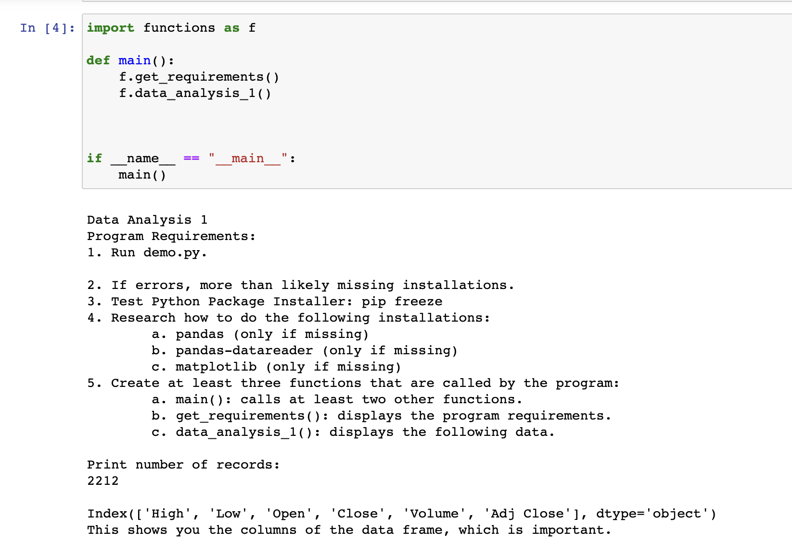
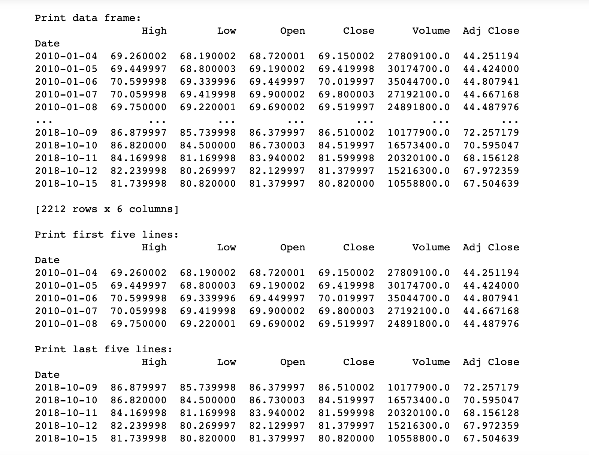
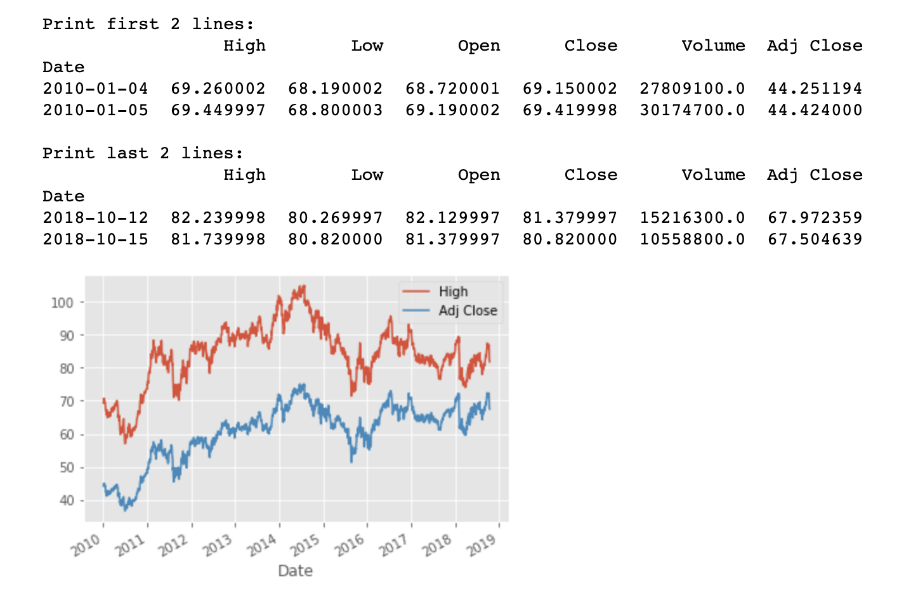

# LIS4369 Extensible Enterprise Solutions

## Rachel Hester

### Project 1 Requirements:

#### README.md file should include the following items:

1. Assignment requirements, as per P1.
2. Screenshots as per examples below.
3. Upload P1 .ipynb file andcreate link in README.md;
    Note:*Before* uploading .ipynbfile, *be sure* to do the following actions from Kernal menu:
     - Restart & Clear Output
     - Restart & Run All

> This is a blockquote.
> 
> This is the second paragraph in the blockquote.
>

#### Assignment Screenshots:
1. Screenshots of Skillsets 7, 8, & 9

2. Screenshots of Jupyter Notebook

*Links to Notebook and Python File Below:* 

1. Links to Python Files
[Python File](docs/functions.py "P1 Python File Functions")
[Python File](docs/main.py "P1 Python File Main")

2. Link to Notebook
[Notebook](docs/P1_New.ipynb "P1 Jupyter Notebook")

