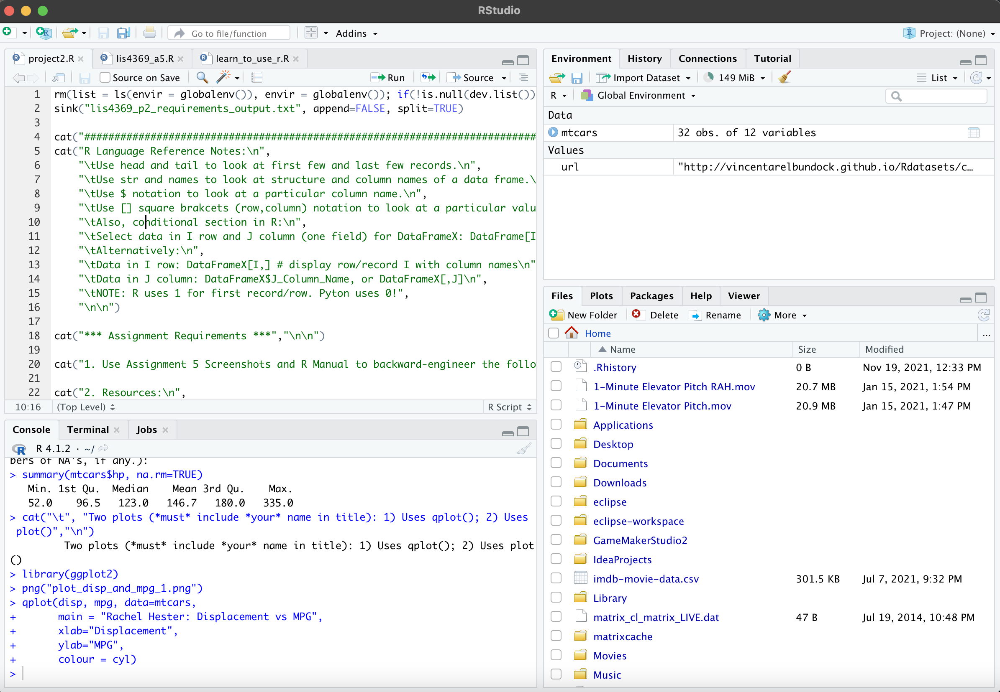
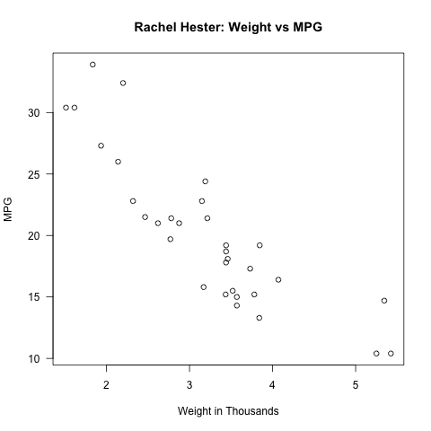
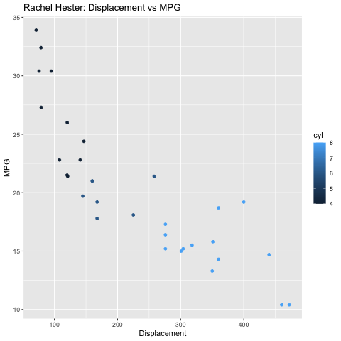

# LIS4369 Extensible Enterprise Solutions

## Rachel Hester

### Project 2 Requirements:

#### README.md file should include the following items:

1. Requirements: 
    - a. Save as lis4369_p2.R. Include link to file in p2 README.md file. 
    - b. Include link to lis4369_p2_output.txt file 
    - c. Include at least one 4-panel RStudio screenshot executing lis4369_p2.R code. 
    - d. Also, be sure to include at least two plots (*must* include *your* name in plot titles), in your README.md file. See examples below. 
 
2. Be sure to test your program using RStudio. 

    - Part 2 
    - README.md file should include the following items: 
        1. Assignment requirements, as per A1. 
        2. Screenshots of output. 
 

> This is a blockquote.
> 
> This is the second paragraph in the blockquote.
>

#### Assignment Screenshots:
1. Screenshots of RStudio

*Screenshot of 4-Panel RStudio*:

*Screenshot of Graph 1*:             |  *Screenshot of Graph 2*:
:-------------------:|:------------------------------:
  |  

*Links to R Files Below:* 

1. Links to R Files
[R File](docs/lis4369_p2_requirements_output.txt "Output Text File")
[R File](docs/project2.R "P2 RStudio File")

